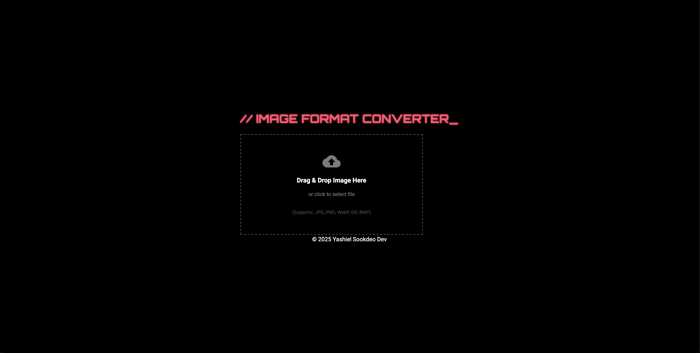

# Futuristic Image Converter



A sleek, modern web application built with React and Vite for converting image formats. Designed with a futuristic aesthetic, smooth animations, and an intuitive user experience.

---

## Features 🚀

*   **Futuristic UI/UX:** Dark theme with neon pink accents (#ff5d73) and sharp, minimalistic components.
*   **Smooth Animations:** Engaging transitions and interactive elements powered by Framer Motion.
*   **Drag & Drop Upload:** Easily upload images using the intuitive drag-and-drop zone (powered by React Dropzone).
*   **Automatic Format Detection:** Detects the input image format automatically based on MIME type.
*   **Multiple Format Support:**
    *   **Input:** Accepts common image types (JPEG, PNG, WebP, GIF, BMP, etc.).
    *   **Output:** Convert to JPEG, PNG, WebP. *(Note: GIF conversion currently outputs the first frame)*.
*   **Client-Side Conversion:** Fast processing directly in the browser using the Canvas API.
*   **Responsive Design:** Adapts to different screen sizes for usability on desktop and mobile.
*   **Clear Feedback:** Visual indicators for upload state, conversion progress, and success/error messages.
*   **Easy Download:** Download the converted image with a single click (using FileSaver.js).

---

## Tech Stack 💻

*   **Frontend:** React (with Vite)
*   **Animations:** Framer Motion
*   **File Handling:** React Dropzone
*   **File Saving:** FileSaver.js
*   **MIME Handling:** mime-types
*   **Styling:** CSS (with CSS Variables for theming)
*   **Build Tool:** Vite

---

## Getting Started 🛠️

Follow these instructions to get a copy of the project up and running on your local machine for development and testing purposes.

### Prerequisites

*   Node.js (v18 or later recommended)
*   npm or yarn

### Installation

1.  **Clone the repository:**
    ```bash
    git clone https://github.com/yashielsookdeo/futuristic-converter.git
    cd futuristic-converter
    ```
2.  **Install dependencies:**
    ```bash
    npm install
    # or
    yarn install
    ```

### Running the Development Server

1.  **Start the Vite development server:**
    ```bash
    npm run dev
    # or
    yarn dev
    ```
2.  Open your browser and navigate to `http://localhost:5173` (or the port specified in the console).

---

## How to Use 🤔

1.  **Upload Image:** Drag and drop an image file onto the designated area, or click the area to open the file selector.
2.  **Select Output Format:** Once an image is uploaded, choose your desired output format (e.g., PNG, JPEG, WebP) from the dropdown menu.
3.  **Convert:** Click the "Initiate Conversion" button. A progress indicator will appear.
4.  **Download:** After successful conversion, the "Download Converted Image" button will become active. Click it to save the new file.
5.  **Reset:** Click "Upload New Image" to clear the current state and start over.

---

## Known Limitations & Potential Enhancements

*   **Client-Side Only:** Conversion happens in the browser. Very large images might hit browser memory limits or performance bottlenecks.
*   **GIF Animation:** Converting *from* animated GIFs currently only processes the first frame. Converting *to* animated GIF is not supported.
*   **Limited Output Formats:** Primarily supports core web formats (JPEG, PNG, WebP). Adding formats like BMP or TIFF might require additional canvas handling.
*   **No Quality Settings:** Currently uses default or preset quality settings (e.g., for JPEG). Adding sliders for quality/compression could be a future enhancement.
*   **Batch Conversion:** Only single-file conversion is supported currently.
*   **Image Preview:** No preview of the *converted* image before download.

---

## Contributing

Contributions are welcome! Please feel free to submit a Pull Request or open an Issue.

---

## License

This project is licensed under the MIT License.